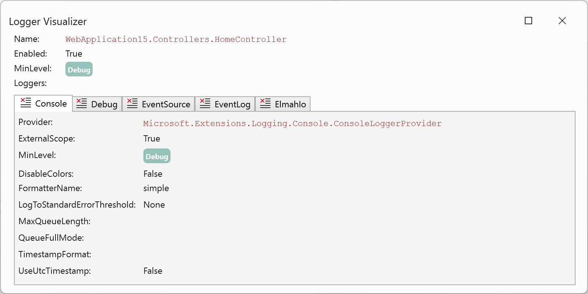
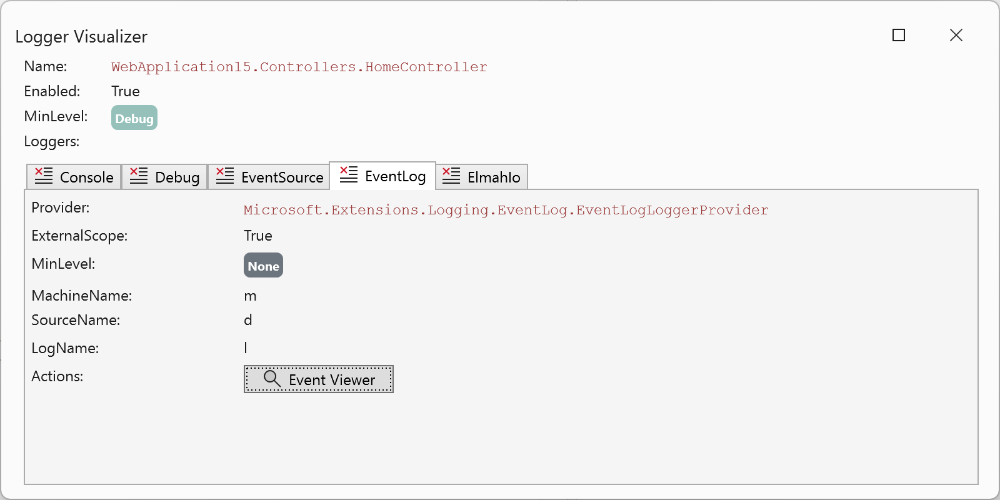

#  Logger Visualizer 

Logger Debug Visualizer for Visual Studio.

When debugging applications and an `ILogger` is available in the code you can view the logger configuration details in a more structured and visually pleasing form:

The extension shows all configured loggers with a set of default properties. For a range of known logging providers, the extension show a special UI. Like for `EventLog`:

And elmah.io:

Feel free to reach out or send a PR if you own a provider with additional content.

---

Sponsored by [elmah.io](https://elmah.io).